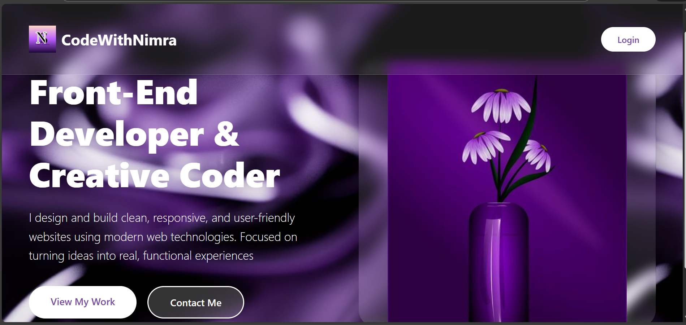
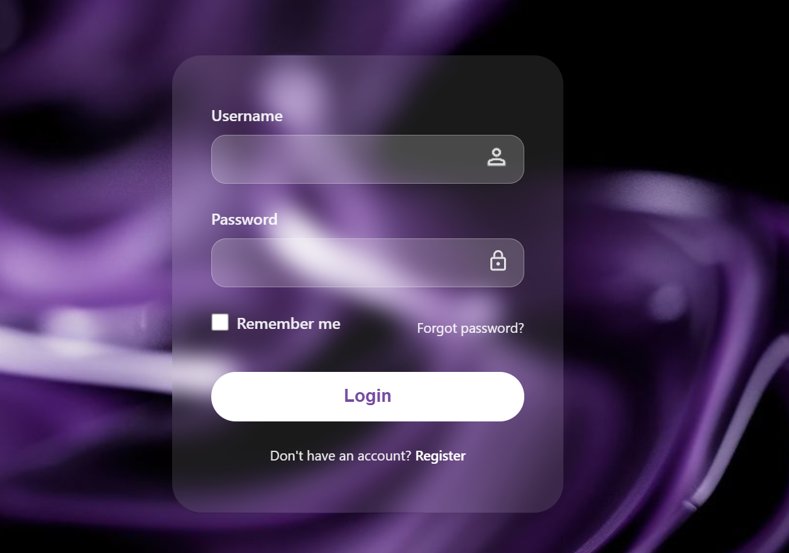
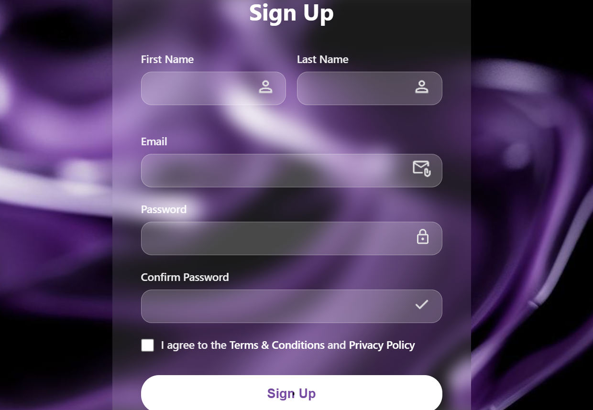

# Login & Sign Up Page

A modern, responsive login and signup page with a beautiful purple gradient theme and glassmorphism design.

## 🌟 Features

- **Modern UI Design**: Clean and elegant interface with glassmorphism effects
- **Responsive Layout**: Fully responsive design that works on all devices
- **Multiple Pages**: 
  - Landing page with portfolio introduction
  - Login page with authentication form
  - Sign-up page with registration form
- **User-Friendly Forms**: 
  - Input validation
  - Password visibility toggle
  - Remember me functionality
  - Terms and conditions agreement
- **Smooth Animations**: Subtle transitions and hover effects
- **Custom Icons**: Person, email, and lock icons for better UX

## 📸 Screenshots

### Landing Page

*Main portfolio landing page showcasing the developer's introduction*

### Login Page

*Clean login form with username/password fields and remember me option*

### Sign Up Page

*Registration form with first name, last name, email, password, and confirmation fields*

## 🛠️ Technologies Used

- **HTML5**: Semantic markup structure
- **CSS3**: Modern styling with:
  - Flexbox/Grid layouts
  - CSS animations
  - Glassmorphism effects
  - Custom gradients
  - Media queries for responsiveness

## 📁 Project Structure

```
loginandsignup/
│
├── index.html          # Landing/Home page
├── index.css           # Styles for landing page
├── login.html          # Login page
├── login.css           # Styles for login page
├── signup.html         # Sign up page
├── signup.css          # Styles for signup page
│
├── images/
│   ├── N.png           # Logo icon
│   ├── logo.jpg        # Main logo
│   ├── logo2.jpg       # Secondary logo
│   ├── background.jpg  # Background image
│   ├── sideimage.jpg   # Side panel image
│   ├── sideimage1.jpg  # Alternative side image
│   ├── person.png      # Person icon
│   ├── email.png       # Email icon
│   ├── lock.svg        # Lock icon
│   └── tick.png        # Checkmark icon
│
└── README.md           # Project documentation
```

## 🚀 Getting Started

### Prerequisites

- A modern web browser (Chrome, Firefox, Safari, Edge)
- A code editor (VS Code, Sublime Text, etc.) - optional

### Installation

1. Clone the repository:
   ```bash
   git clone https://github.com/NIMRA47/Login-SignUp-page.git
   ```

2. Navigate to the project directory:
   ```bash
   cd Login-SignUp-page
   ```

3. Open `index.html` in your browser to view the landing page, or open `login.html` / `signup.html` directly.

### Usage

- **Landing Page**: Open `index.html` to view the portfolio introduction page
- **Login**: Click the "Login" button or navigate to `login.html`
- **Sign Up**: Click "Register" from the login page or open `signup.html` directly

## 🎨 Color Scheme

The project uses a purple gradient theme:
- Primary: Purple shades (#8B5CF6, #A855F7)
- Background: Dark purple to black gradients
- Accent: White for text and buttons
- Glassmorphism: Semi-transparent overlays with backdrop blur

## 📱 Responsive Design

The application is fully responsive and optimized for:
- Desktop (1920px and above)
- Laptop (1024px - 1919px)
- Tablet (768px - 1023px)
- Mobile (320px - 767px)

## 🔐 Form Features

### Login Form
- Username/Email input
- Password input with security icon
- "Remember me" checkbox
- "Forgot password?" link
- Link to registration page

### Sign Up Form
- First name and last name fields
- Email validation
- Password field
- Confirm password field
- Terms & Conditions agreement checkbox
- Form validation

## 🤝 Contributing

Contributions, issues, and feature requests are welcome!

1. Fork the project
2. Create your feature branch (`git checkout -b feature/AmazingFeature`)
3. Commit your changes (`git commit -m 'Add some AmazingFeature'`)
4. Push to the branch (`git push origin feature/AmazingFeature`)
5. Open a Pull Request

## 👤 Author

**NIMRA**
- GitHub: [@NIMRA47](https://github.com/NIMRA47)
- Portfolio: CodeWithNimra

## 📝 License

This project is open source and available under the [MIT License](LICENSE).

## 🙏 Acknowledgments

- Design inspiration from modern UI/UX trends
- Icons and images used in the project
- Glassmorphism design pattern

---

⭐ If you like this project, please give it a star on GitHub!